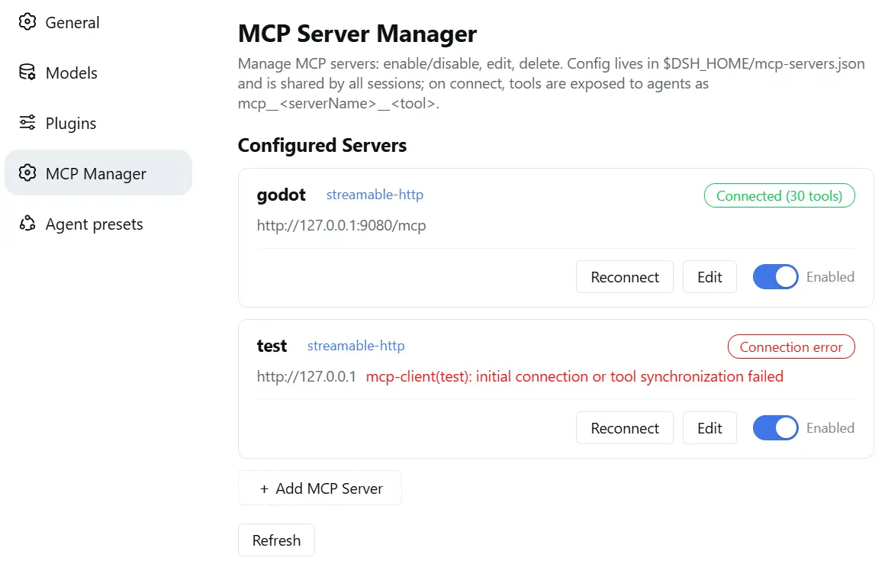

# dsh-mcp-manager

[English](README.md) | [中文](README.zh.md)

Manage **MCP servers** right from the DeepSeek Harness Web settings page — add, edit, enable/disable, reconnect and delete servers at runtime, with live status, automatic reconnect and config-file hot sync.

## Features

- **Web settings UI** — a dedicated "MCP Server Manager" page: server cards with live status, an add/edit form, and two-step delete protection.
- **Runtime connections** — servers connect/disconnect on the fly; tools are registered globally as `mcp__<serverName>__<tool>` for every session.
- **Live status** — reachability probing so a closed server shows **offline** instead of a stale "connected"; a stuck connection times out after 30 s.
- **Auto-reconnect** — a failed initial connect retries with exponential backoff (3 s → 60 s); pressing refresh retries immediately.
- **Enable/disable** — switch a server off to disconnect and unload its tools; switch it on to reconnect.
- **Config file hot sync** — `$DSH_HOME/mcp-servers.json` is watched; external edits take effect within ~1 s, no restart needed.
- **Themes & i18n** — follows DSH light/dark mode (and `--dsw-alias-*` token overrides from appearance plugins); UI ships in **简体中文 / English**.

## Screenshot



## Install

### For humans

1. Get the code and build it: `git clone <repo> && cd dsh-mcp-manager && npm install` (the `prepare` script builds `lib/` automatically; releases with a prebuilt `lib/` skip this).
2. Make the package resolvable from the profile (pick one):
   - copy or symlink the whole `dsh-mcp-manager/` folder into `$DSH_HOME/profiles/web/node_modules/`, or
   - `dsh plugin --profile web add <path-to-repo>`.
3. Append to `$DSH_HOME/profiles/web/cordis.patch.yml`:

   ```yaml
   - insert:
       - id: mcp-manager
         name: dsh-mcp-manager
   ```

4. **Restart `dsh web`** and hard-refresh the browser page (`Ctrl+Shift+R`) so the new `__DSH_BOOT__` loads.
5. Open **Settings → MCP Server Manager** and add your first server.

> Note: hot reload of `cordis.patch.yml` is disabled on the Web surface (DSH's shared HMR row is off), so configuration changes need a restart.

### For AI agents

Follow every step, in order:

1. **Read this README in full** (especially *Features*, *Known limitations*, and this install section).
2. **Build if needed**: from `dsh-mcp-manager/` run `npm install --ignore-scripts && npm run build` (produces self-contained `lib/index.js` + `lib/client.js`; the plugin has zero runtime dependencies).
3. **Link into the profile**: create a directory junction (Windows) or symlink (POSIX) at `$DSH_HOME/profiles/<profile>/node_modules/dsh-mcp-manager` pointing at this repository, so the loader can resolve the package name. (Alternatively: `dsh plugin --profile <profile> add <path>`.)
4. **Mount the plugin row**: append to `$DSH_HOME/profiles/<profile>/cordis.patch.yml`:

   ```yaml
   - insert:
       - id: mcp-manager
         name: dsh-mcp-manager
   ```

5. **Restart `dsh web`** (Web-surface config hot reload is disabled) and tell the user to **hard-refresh** the browser so the settings page shows the new section.
6. **Verify**: `GET http://127.0.0.1:3080/mcp-manager/api/health` must return `{"ok":true,"name":"mcp-manager","version":"<x.y.z>",...}`.

## Usage

Open **Settings → MCP Server Manager**:

- **Server cards** show the name, transport, status badge and endpoint; disabled cards are dimmed.
- **Enable/disable switch** — disabling disconnects immediately and unloads the server's tools.
- **Reconnect** — waits for the connection result and refreshes automatically (configurable wait, default 15 s).
- **Edit** — change transport / URL / command / headers (`serverName` is immutable); saving hot-reconfigures the live connection.
- **Delete** — lives at the top of the edit page, behind a two-step confirm (3 s window).
- **Add** — `streamable-http` (URL + optional headers) or `stdio` (command + args), with a configurable connection-wait timeout.

### Statuses

| Status | Meaning |
|---|---|
| Connected (n tools) | tools are registered |
| Connecting | handshake / reconnecting in progress |
| Offline | was connected, but the server process is unreachable (probed) |
| Error | initial connect failed (reason shown) or 30 s connect timeout |
| Disabled | switched off — not connected, no tools |

### Configuration file

`$DSH_HOME/mcp-servers.json` — shared by every profile and session:

```json
{
  "version": 1,
  "servers": [
    { "serverName": "my-server", "transport": "streamable-http", "url": "http://127.0.0.1:8080/mcp", "enabled": true }
  ]
}
```

The file is **watched live**: manual edits (add / remove / change / enable) take effect within ~1 s; `POST /mcp-manager/api/reload` triggers it on demand.

### HTTP API

| Method | Path | Purpose |
|---|---|---|
| GET | `/mcp-manager/api/health` | liveness + version + store path |
| GET | `/mcp-manager/api/servers` | list with live (probed) status |
| GET | `/mcp-manager/api/servers/<name>` | single server |
| POST | `/mcp-manager/api/servers` | add & connect |
| POST | `/mcp-manager/api/servers/<name>/update` | update config & hot-reconnect (`serverName` immutable) |
| POST | `/mcp-manager/api/servers/<name>/toggle` | enable / disable (`{"enabled": true|false}`) |
| POST | `/mcp-manager/api/servers/<name>/reconnect` | disconnect & reconnect |
| DELETE | `/mcp-manager/api/servers/<name>` | disconnect & delete |
| POST | `/mcp-manager/api/reload` | re-read the config file from disk |

## Development

```sh
npm install      # build-only devDependencies; prepare auto-builds
npm run build    # esbuild: lib/index.js (host, fully bundled) + lib/client.js (browser)
npm run watch    # watch the client bundle (works with dsh-client-hmr)
```

No runtime dependencies: the host half inlines `@deepseek-ai/dsh-mcp-client`, the MCP SDK and `cross-spawn`; the browser half is a closure-factory bundle served by DSH's client module system.

## Known limitations

- **Initial failure retries with backoff, not instantly** — `failOnStartupError` is on, so a failed first connect shows `error` and retries up to every 60 s; once connected, mcp-client's own reconnect handles drops.
- **Reachability probing is HTTP-level** — a GET with a 2.5 s timeout for `streamable-http` servers (any HTTP response counts as reachable); `stdio` servers are not probed.
- **Tools only** — MCP Resources/Prompts are not bridged (same as the official mcp-client).
- **No auth on `/mcp-manager/*`** — loopback-only by default; be careful exposing `--host 0.0.0.0` (stdio servers execute arbitrary commands).
- **Some MCP servers allow only one active client** (e.g. Godot MCP) — a second connection is rejected until the first is released.

## License

MIT
